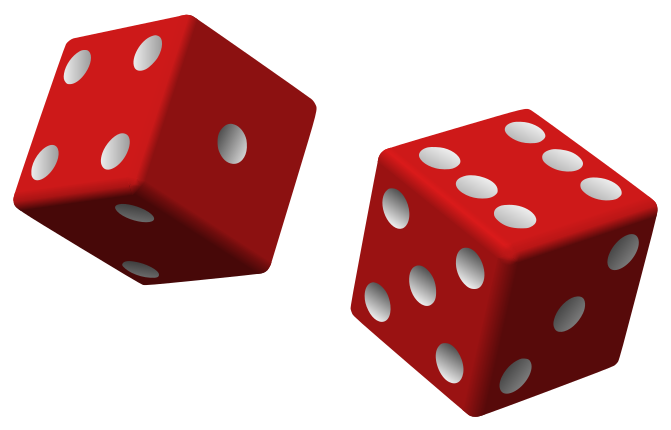
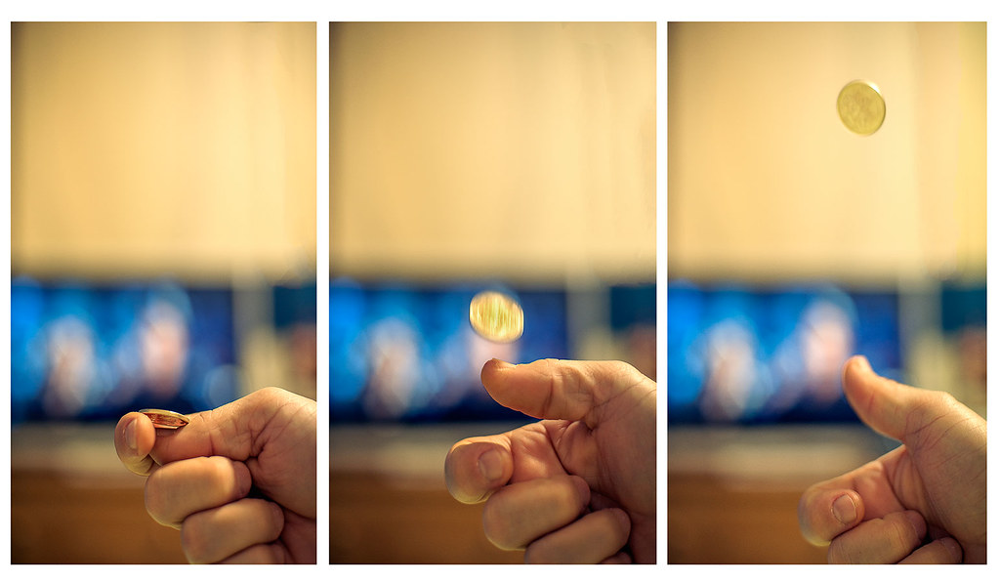

# Sample Space / Espacio Muestral

#### English
A sample space of an experiment is the set of all possible outcomes or results of that experiment.
the common lebels are S, Ω, or U (Universal Set)

#### Español
Un espacio muestral, es el conjunto de posibles resultados de un experimento.
En la literatura se puede encontrar como S, Ω, o U (Conjunto Universal)

#### Example 1 / Ejemplo 1

|     Event    |    Sample Space   |
|:------------:|:-----------------:|
|Throw a dice  | Ω = {1,2,3,4,5,6} | 

|    Evento    |  Espacio muestral |
|:------------:|:-----------------:|
|Lanzar un dado| Ω = {1,2,3,4,5,6} |

#### Example 2 / Ejemplo 2

|     Event    |    Sample Space   |
|:------------:|:-----------------:|
|Coin Flipping | Ω = {Head, Tail} | 

|    Evento    |  Espacio muestral |
|:------------:|:-----------------:|
|Lanzar una moneda| Ω = {Cara, Sello} |

