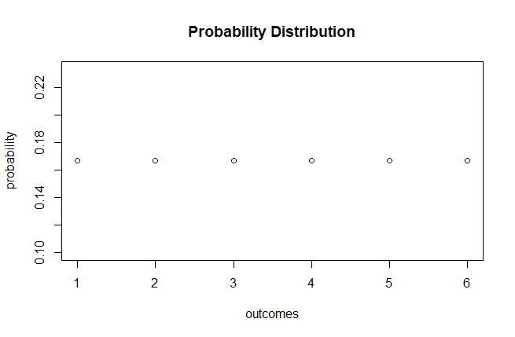

# Random Variable / Variable Aleatoria

### English
Are 2 types of random variable:
- Discrete: only values 1,2,3,...
- Continous: any real values between 0 and 1

### Español
Hay 2 tipos de variables aleatorias:
- Discreta: puede tomar valores como 1,2,3,...
- Continuas: puede tomar valores reales entre 0 y 1

# Probability Function (Discrete) / Función de Probabilidad (Discreta)

### English

It is a function that assigns at each point of the sample space X = {𝒙𝟎, 𝒙𝟏,…, 𝒙𝒏} a chance that it will happen.

𝑃(𝑥𝑖)=𝑝𝑖

In which 𝑝𝑖 is the probability of 𝑋= 𝑥𝑖 it will happen.

Taking into account that:

### Español

Es una función que a cada punto del espacio muestral X = {𝒙𝟎, 𝒙𝟏,…, 𝒙𝒏} le asigna una probabilidad de que éste suceda.

𝑃(𝑥𝑖)=𝑝𝑖

En la cual 𝑝𝑖 es la probabilidad de que 𝑋= 𝑥𝑖 suceda.

Teniendo en cuenta que:

## Probability Distribution / Distribución de Probabilidades

### Roll a dice / Lanzar un dado

### English

Probability distribution is the form we can represent the probabilities of an event, and the addition must give always 1 (100%).

### Español 

La distribución de probabilidad es la forma de representar las probabilidades de un evento, y la suma debe dar siempre 1 (100%).

# Density Function / Función de densidad

### English

It is a function that seeks to find the accumulated probability up to a certain value and how it changes at different points.

In which X is a continuous non-negative variable, to which:

### Español

Es una función que busca hallar la probabilidad acumulada hasta cierto valor y como ésta cambia en diferentes puntos.

En la cual X es una variable continua no negativa, a la cual:

# References / Referencias
- [Link 1](https://rpubs.com/jcross/discreteRV)
- [Link 2](https://www.econometrics-with-r.org/2-1-random-variables-and-probability-distributions.html)
- [Link 3](https://www.rdocumentation.org/packages/stats/versions/3.6.1/topics/density)