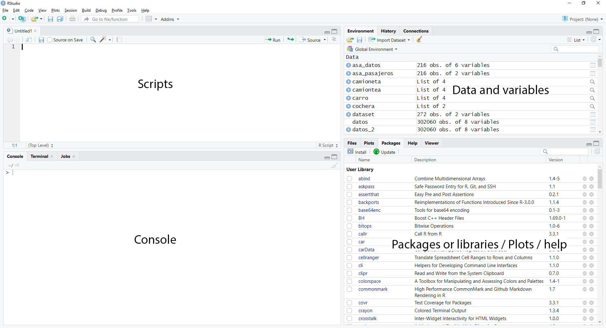

# Probability and statistics R
### R Manual

## Contents / Contenido
- [0. Set Up / Instalación](https://github.com/TheGlitchCat/probability-and-statistics-R/tree/master/00-set-up)
- [1. Variables](https://github.com/TheGlitchCat/probability-and-statistics-R/tree/master/01-Variables)
- [2. Sample Space / Espacio Muestral](https://github.com/TheGlitchCat/probability-and-statistics-R/tree/master/02-Sample%20Space)
- [3. Data types / Tipos de Datos](https://github.com/TheGlitchCat/probability-and-statistics-R/tree/master/03-Data%20Types)
- [4. Boxplot / Diagrama de Cajas](https://github.com/TheGlitchCat/probability-and-statistics-R/tree/master/04-Boxplot)


## Environmnet / Entorno


## Adding libs or pkg / Instalar paquetes o librerias
### One / Una
In console / en la consola
```
install.packages("<pkg/lib name>")
```
### Multiple / Varias
```
install.packages(c("<pkg/lib name>", "<pkg/lib name>",...,"<pkg/lib name>"))
```

## Easy way to use python into R / La manera facil de usar python en R
```
install.packages("reticulate")
```

```R
library(reticulate)
py_run_string("
x = 10
y = 11
def sum(x,y):
  return x + y


print(sum(x,y))
")
```

```R
library(reticulate)
py_run_file("script.py")
```

### for more info / para mas informacion
- [Link 1](https://cran.r-project.org/web/packages/reticulate/vignettes/calling_python.html)
- [Link 2](http://rstudio-pubs-static.s3.amazonaws.com/407460_396f867ce3494d479fd700960879e22c.html)
- [Link 3](https://blog.rstudio.com/2018/03/26/reticulate-r-interface-to-python/)


## Help commmand / Comandos de ayuda 
### Some example  / Algunos ejemplos

```R
?ggplot2 # ?<pkg/lib name>
library(help="ggplot2") #library(help="<pgk/lib name>")
help("read.table")  #help("<pkg/lib name>") 
example("read.table") # example("<pkg/lib name>")
vignette("Intro2Matrix") # vignette("<pkg/lib name>")
```

## R Basics / R Basico
```R
# types / tipos
x <- "a"            #character: "a", "string" / letra o cadena de letras
x <- 2              #numeric: 3, 100.5 / numerico
x <- 3L             #integer: 2L (L makes R store this as an int) / entero
x <- 1+3i           #complex: 1+4i (complex numbers with real and imaginary parts) / complejo
x <- TRUE           #logical: TRUE, FALSE / logico

# vectors / vectores 
vector()            #empty vector / vector vacio
x <- c("a", "b")    #vector with a and b / vector con a y b
character(5)        #empty vector of character / vector vacio de letras
numeric(5)          #empty vector of numeric / vector vacio de numeros
logical(5)          #vector of bool (default=FALSE) / vector vacio de booleanos (por defecto = FALSE)

# secuences / secuencias
x <- 1:10           #secuence from 1 to 10 / secuencia del 1 al 10
x <- seq(from=1, to= 10, by=1) #secuence function from=start to=end by=step by step / funcion de secuencia from=inicio to=fin by=paso a paso

```

# References 

| Book | Author(s) |
|:-----|:---------:|
| [A Modern Introduction to Probability and Statistics](https://cis.temple.edu/~latecki/Courses/CIS2033-Spring13/Modern_intro_probability_statistics_Dekking05.pdf) | F.M. Dekking C. Kraaikamp H.P. Lopuhaa L.E. Meester |
| [Applied Statistics and Probability for Engineers](http://www.um.edu.ar/math/montgomery.pdf) | Douglas C. Montgomery and George C. Runger |
| [Probability and Statistics - The Science of Uncertainty](http://www.utstat.toronto.edu/mikevans/jeffrosenthal/book.pdf) | Michael J. Evans and Je§rey S. Rosenthal |
| [THE ART OF R PROGRAMMING](http://diytranscriptomics.com/Reading/files/The%20Art%20of%20R%20Programming.pdf)| Norman Matloff |
